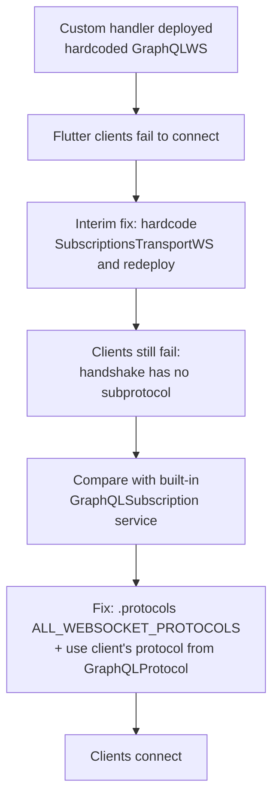

# Postmortem: GraphQL subscription WebSocket connections failing for Flutter clients

**Status:** Resolved
**Date of incident:** 2026-09-25
**Authors:** Jacob Curley
**Service:** extapi-acsys (GraphQL subscription endpoints)
**Severity:** Critical

## Summary
After a custom WebSocket handler, [`graphql_ws_handler()`](src/graphql/auth_handlers.rs:81), replaced the built-in async-graphql subscription service, Flutter clients could no longer connect to any GraphQL subscription stream. The handler had two problems. It never confirmed a WebSocket subprotocol to the client during the connection handshake, and it hardcoded a single GraphQL WebSocket protocol instead of using the one the client asked for. Clients rejected the handshake, so no subscription data reached them. The fix registers the supported subprotocols with `.protocols(...)` and uses the protocol each client requests.

## Impact
- **Affected:** All Flutter clients using GraphQL subscriptions. Every subscription route registered in [`src/graphql.rs`](src/graphql.rs:99) uses the same handler (see also [line 130](src/graphql.rs:130) and [line 305](src/graphql.rs:305)).
- **Not affected:** GraphQL queries and mutations over HTTP (handled by [`graphql_handler()`](src/graphql/auth_handlers.rs:38) and [`unr_graphql_handler()`](src/graphql/auth_handlers.rs:53)).
- **Duration:** [start time] to [resolution time] ([total])
- **User-visible symptom:** Subscription connections were closed right after the upgrade, before any GraphQL messages were exchanged.

## Background
The handler was added so the service could authenticate subscriptions by reading a bearer token from the `connection_init` payload ([`websocket_init_handler()`](src/graphql/auth_handlers.rs:186)). That supports the service's zero-trust design. The built-in `GraphQLSubscription` service it replaced handled two things automatically:
1. **Subprotocol negotiation:** it replied with a `Sec-WebSocket-Protocol` header naming the subprotocol it accepted.
2. **Protocol selection:** it detected whether the client used `graphql-transport-ws` or the older `graphql-ws` (subscriptions-transport-ws) and spoke that protocol.

The custom handler dropped both.

## Root cause
### 1. Subprotocol never confirmed (primary cause)
The handler called `ws.on_upgrade(...)` directly on the `WebSocketUpgrade` extractor. Axum only includes a `Sec-WebSocket-Protocol` header in the `101 Switching Protocols` response if the server registers its supported subprotocols with `WebSocketUpgrade::protocols(...)`. Without that call, the response named no subprotocol. Under the WebSocket protocol, a client that asked for a subprotocol should close the connection if the server doesn't confirm one, and the Flutter clients did.

### 2. One protocol hardcoded, then swapped for the other (secondary cause)
The handler at first always passed `WebSocketProtocols::GraphQLWS` to the async-graphql engine, whatever the client asked for. When clients couldn't connect, the team guessed the protocol choice was the problem. As an interim fix, they changed the hardcoded value to `WebSocketProtocols::SubscriptionsTransportWS` and redeployed. Clients still couldn't connect.

That interim fix couldn't work, for two reasons:
- **It didn't touch the real cause.** Whichever protocol was hardcoded, the handshake still didn't confirm a subprotocol (cause 1), so clients closed the connection either way.
- **It swapped one fixed choice for another.** A server that hardcodes one protocol breaks every client using the other one. The fix is to use the protocol each client asks for, not to pick a different default.

The async-graphql variant names probably made this harder to spot. The names don't match the protocol strings sent over the wire:

| `WebSocketProtocols` variant | `Sec-WebSocket-Protocol` value | Protocol |
|---|---|---|
| `GraphQLWS` | `graphql-transport-ws` | Newer protocol (the `graphql-ws` library) |
| `SubscriptionsTransportWS` | `graphql-ws` | Older Apollo `subscriptions-transport-ws` protocol |

Clients requesting `graphql-transport-ws` probably matched the original `GraphQLWS` choice. If so, the interim fix gave those clients the wrong protocol on top of the missing handshake header. Once the header was fixed, they would have still failed at `connection_init`/`connection_ack`.

### Why the interim fix gave a misleading result
Swapping `GraphQLWS` for `SubscriptionsTransportWS` changed nothing the client could see, because the connection closed during the handshake before any GraphQL message was exchanged. That made the protocol choice look irrelevant and hid the second bug.



## Detection
The author of the regression found the problem while manually testing the GraphQL endpoint in the GraphiQL editor. No automated test caught it. The test suite does cover subscriptions: for example, [`alarms_subscription_integration_test()`](src/graphql/alarms/tests.rs:263) runs an `alarms` subscription end to end against a Kafka test harness. However, it and the other subscription and stream tests call the schema directly with `schema.execute_stream(...)` or test the stream types on their own, which skips the axum router and the WebSocket transport. No test sends a WebSocket upgrade request to a subscription route, so nothing exercised [`graphql_ws_handler()`](src/graphql/auth_handlers.rs:81) or the `Sec-WebSocket-Protocol` negotiation.

The Flutter client logs didn't help. They reported only that the WebSocket handshake had failed, with no other context: no requested or returned subprotocol, no HTTP status, and no close code or reason. The production Flutter build is minified, so its logs contain little that helps with debugging. As a result, client logs couldn't show that the server had left out the `Sec-WebSocket-Protocol` response header. That is one reason the interim fix was a guess about the protocol choice rather than a diagnosis.

## Resolution
1. **Found the regression:** the failures started with the switch from the built-in `GraphQLSubscription` service to the custom handler in [`src/graphql/auth_handlers.rs`](src/graphql/auth_handlers.rs:81).
2. **Compared with the built-in service:** it reads the client's protocol with the `GraphQLProtocol` extractor and calls `.protocols(ALL_WEBSOCKET_PROTOCOLS)` before upgrading. The custom handler did neither.
3. **Updated the handler** to:
   - take a `protocol: GraphQLProtocol` argument, which reads the client's requested subprotocol;
   - call `ws.protocols(ALL_WEBSOCKET_PROTOCOLS)` before `on_upgrade`, so the chosen subprotocol is sent back in the handshake;
   - pass the client's protocol to the engine instead of the hardcoded `SubscriptionsTransportWS`;
   - keep `.on_connection_init(websocket_init_handler)`, so token authentication still works.
4. **Verified:** Flutter clients connect and receive subscription data again.

Corrected handler (shown using `GraphQLWebSocket`):
```rust
ws.protocols(ALL_WEBSOCKET_PROTOCOLS)
    .on_upgrade(move |socket| {
        GraphQLWebSocket::new(socket, schema, protocol)
            .on_connection_init(websocket_init_handler)
            .serve()
    })
```

## What went well
- Manual testing in the GraphiQL editor caught the problem.
- The failure was traced to one handler, and the fix was small.
- HTTP queries and mutations kept working throughout.
- Authentication through `websocket_init_handler` didn't need to change.

## What went wrong
- Behavior the library handled for us (subprotocol negotiation and protocol selection) was lost when the built-in service was replaced, and it wasn't obvious that it had been lost.
- No automated test covered the WebSocket handshake, so the regression shipped, and it was found only through manual testing.
- The Flutter error logs said only that the WebSocket handshake failed. The production Flutter build is minified, so the logs had no useful detail for finding the cause, and debugging had to rely on the server side.
- A guess (changing the hardcoded protocol) was deployed to production without first checking the handshake with a WebSocket client or a packet capture. That cost an extra deploy. An integration test checking the `Sec-WebSocket-Protocol` response header would have found the real cause right away.

## Action items
| # | Action | Owner | Status |
|---|--------|-------|--------|
| 1 | Register supported subprotocols with `.protocols(...)` and use the client's protocol | [Owner] | Done |
| 2 | **Add integration tests to the CI/CD pipeline** that start the server and open real WebSocket connections to the subscription endpoints (see plan below) | [Owner] | Planned |
| 3 | Pass close codes and reasons through to clients (for example `4403 Forbidden` on auth failure) instead of sending `Message::Close(None)`, if the custom send/receive loop is kept | [Owner] | [Status] |
| 4 | Check the `connection_init` payload shape the Flutter clients send (`Authorization` vs `authorization` vs a nested `headers` object) and handle each case | [Owner] | [Status] |
| 5 | Add a review checklist item: when replacing a library-provided handler, list the behavior it handled and confirm each item is kept | [Owner] | [Status] |

## Prevention: integration tests in CI/CD
To catch this kind of failure before release, the team will add integration tests that run in CI/CD on every pull request and block merges on failure. For each subscription endpoint, the tests should:
1. **Check the handshake for each protocol:** connect once with `graphql-transport-ws` and once with `graphql-ws`, and assert that the `101` response names the requested subprotocol in `Sec-WebSocket-Protocol`.
2. **Check the protocol flow:** send `connection_init` and assert that `connection_ack` comes back in the right format for that protocol.
3. **Check authentication:** a valid bearer token in the `connection_init` payload is accepted, and a token with the wrong scheme is rejected with a close code the client can act on.
4. **Check end-to-end delivery:** start a subscription against a stubbed gRPC backend and assert that at least one `next`/`data` message arrives.
5. **Check real client compatibility (optional):** run a small test using the Flutter GraphQL client package the apps use, so client-specific handshake behavior is tested too.

These tests would have failed at step 1 for both protocols and stopped the regression before release.